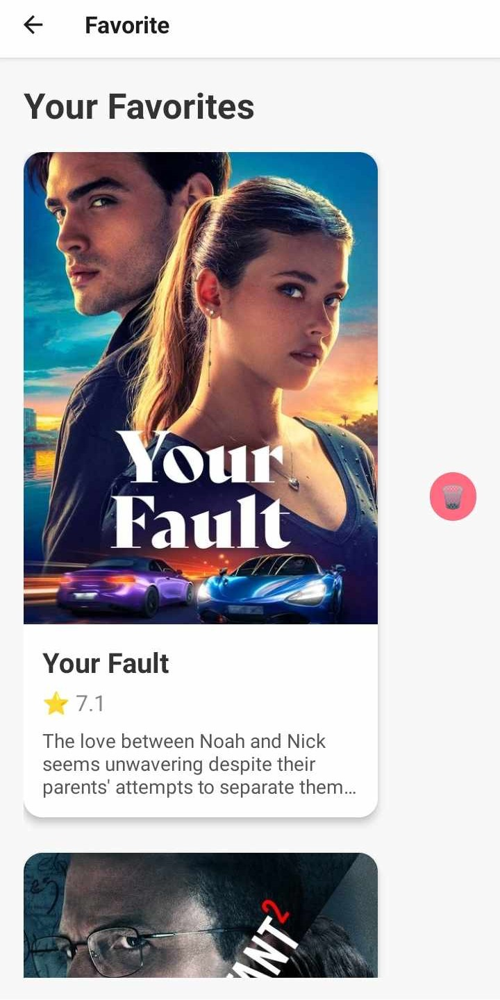

ชื่อ - นามสกุล (Full Name):Siravit Thakaew
รหัสนักศึกษา (Student ID):6631503041
ชื่อแอป (App Name):
Framework ที่ใช้ (Framework Used):Expo + React Native + TypeScript
ลิงก์ GitHub Repository: [(https://github.com/STLSRV/RandomMoviePicker-app.git)]
ลิงก์ไฟล์ติดตั้ง (APK/IPA): [(https://drive.google.com/file/d/19GfyeCULCpiXXMSsB9SKC8radItyka6_/view?usp=sharing)]

1. การออกแบบแอป | App Concept and Design (2 คะแนน / 2 pts)
1.1 ผู้ใช้งานเป้าหมาย | User Personas
ตัวอย่าง (Example):

Persona 1:  
- ชื่อ: อิคคิว  
- อายุ: 20 ปี  
- อาชีพ: นักศึกษาปี 2  
- ความต้องการ: ไม่รู้ว่าจะดูหนังไรดีเลยใช้

Persona 2:  
- ชื่อ: น็อต  
- อายุ: 20 ปี  
- อาชีพ: นักศึกษาปี 2  
- ความต้องการ: ไม่รู้ว่าจะดูหนังไรดีเลยใช้
1.2 เป้าหมายของแอป | App Goals
ตัวอย่าง (Example):

- ช่วยในการตัดสินใจในการดูหนัง
- ดูเทลเลอร์หรือคะแนนก่อนดูได้
1.3 โครงร่างหน้าจอ / Mockup
- หน้า Home จะมีปุ่ม Favorite กับ Random Movie ถ้ากด Random Movie ก็จะมีโปสเตอร์หนังขึ้นมา
- หน้า Favorite จะมีหนังที่เรากด Favorite ไว้
- หน้า Detail จะมีรายละเอียดหนังชื่อหนังคะแนนของหนังมีปุ่มดู Trailer ใน YouTube ได้และปุ่ม Add Favorite เพื่อ Favorite หนังนั้น

1.4 การไหลของผู้ใช้งาน | User Flow
Home > Favorite
Home > Detail

2. การพัฒนาแอป | App Implementation (4 คะแนน / 4 pts)
2.1 รายละเอียดการพัฒนา | Development Details
เครื่องมือที่ใช้ / Tools used:
- React Native 0.76.9
- TypeScript 5.3.3
- Expo ~52.0.46
- React 18.3.1

- Package::native, native-stack, async-storage, react-native-dotenv, axios, expo-linear-gradient, vector-icons, expo-dev-client, expo-status-bar,react-native-safe-area-context, react-native-screens, react-native-gesture-handler
- Dev Tools:@babel/core, @types/react, typescript
2.2 ฟังก์ชันที่พัฒนา | Features Implemented
Checklist:

- [x] เพิ่ม / ลบ Favorite
- [x] สุ่มหนัง
- [x] ดูDetailของหนัง
- [x] กดดู trailer ใน YouTube
- [x] เก็บข้อมูล Favorite ใน App
2.3 ภาพหน้าจอแอป | App Screenshots
แนบภาพหรือ URL (Attach images or image links):

- 
- 
- 
- 

3. การ Build และติดตั้งแอป | Deployment (2 คะแนน / 2 pts)
3.1 ประเภท Build | Build Type
[ ] Debug
[x] Release
3.2 แพลตฟอร์มที่ทดสอบ | Platform Tested
[x] Android
[ ] iOS
3.3 ไฟล์ README และวิธีติดตั้ง | README & Install Guide
แนบไฟล์หรือคำอธิบายการติดตั้งแอป | Insert steps
1. ดาวน์โหลดไฟล์ .apk จาก link google drive
2. เปิดในอุปกรณ์ Android
3. ติดตั้งผ่าน File Manager

4. การสะท้อนผลลัพธ์ | Reflection (2 คะแนน / 2 pts)
ตัวอย่างหัวข้อ | Suggested points:

- ปัญหาในการบิ้วไฟล์ APK
- รู้ว่าแพ็คเกจบางตัวไม่สามารถทำงานร่วมกับtypscriptได้
- รู้วิธีการใช้ API และสมัครใช้งาน
- รู้วิธีการ release Application

5. การใช้ AI ช่วยพัฒนา | AI Assisted Development (Bonus / ใช้ประกอบการพิจารณา)
5.1 ใช้ AI ช่วยคิดไอเดีย | Idea Generation
Prompt ที่ใช้:  
"App สุ่มหนังควรมีอะไรบ้าง"

ผลลัพธ์:  
ได้ตัวอย่างฟังก์ชันใน App
5.2 ใช้ AI ช่วยออกแบบ UI | UI Layout Prompt
Prompt ที่ใช้:  
"ช่วยทำตัวอย่างเทมเพลย์ของ 3 หน้านี้ให้หน่อยแล้ว(ก็ส่งรูปภาพไป)"

ผลลัพธ์:  
ได้เทมเพลตของ 3 หน้านั้น
5.3 ใช้ AI ช่วยเขียนโค้ด | Code Writing Prompt
Prompt ที่ใช้:  
"ช่วยเขียน Favoritecontext ตามนี้ให้หน่อย"

ผลลัพธ์:  
Get codes for saving and deleting on the Favorite page.
5.4 ใช้ AI ช่วย debug | Debug Prompt
Prompt ที่ใช้:  
"ทำไมมันfail [BUILD FAILED in 53s
18 actionable tasks: 18 executed
Error: C:\Users\gues8\Documents\GitHub\RandomMoviePicker-app\android\gradlew.bat app:assembleDebug -x lint -x test --configure-on-demand --build-cache -PreactNativeDevServerPort=8081 -PreactNativeArchitectures=arm64-v8a,armeabi-v7a exited with non-zero code: 1
Error: C:\Users\gues8\Documents\GitHub\RandomMoviePicker-app\android\gradlew.bat app:assembleDebug -x lint -x test --configure-on-demand --build-cache -PreactNativeDevServerPort=8081 -PreactNativeArchitectures=arm64-v8a,armeabi-v7a exited with non-zero code: 1
    at ChildProcess.completionListener (C:\Users\gues8\Documents\GitHub\RandomMoviePicker-app\node_modules\@expo\spawn-async\src\spawnAsync.ts:67:13)
    at Object.onceWrapper (node:events:639:26)
    at ChildProcess.emit (node:events:524:28)
    at ChildProcess.cp.emit (C:\Users\gues8\Documents\GitHub\RandomMoviePicker-app\node_modules\cross-spawn\lib\enoent.js:34:29)
    at maybeClose (node:internal/child_process:1101:16)
    at Process.ChildProcess._handle.onexit (node:internal/child_process:304:5)
    at spawnAsync (C:\Users\gues8\Documents\GitHub\RandomMoviePicker-app\node_modules\@expo\spawn-async\src\spawnAsync.ts:28:21)
    at spawnGradleAsync (C:\Users\gues8\Documents\GitHub\RandomMoviePicker-app\node_modules\@expo\cli\src\start\platforms\android\gradle.ts:134:28) 
    at assembleAsync (C:\Users\gues8\Documents\GitHub\RandomMoviePicker-app\node_modules\@expo\cli\src\start\platforms\android\gradle.ts:83:16)     
    at runAndroidAsync (C:\Users\gues8\Documents\GitHub\RandomMoviePicker-app\node_modules\@expo\cli\src\run\android\runAndroidAsync.ts:48:24)]"

ผลลัพธ์:  
AI ช่วยอ่านLog และบอกวิธี
5.5 ใช้ AI ช่วย Deploy | Deployment Prompt
Prompt ที่ใช้:  
"บิ้วแอปให้หน่อยครับพี่"

ผลลัพธ์:  
ได้เลย bro! 💥
เดี๋ยวพี่จะสรุปให้แบบ step-by-step วิธี Build แอป Android (.apk หรือ .aab) ผ่าน Expo เลยนะ
